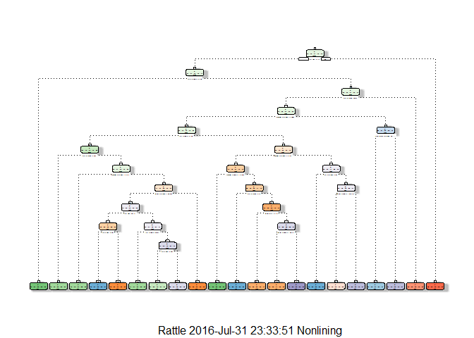

# Prediction Assignment Writeup
Min-Jung Wang  
July 30, 2016  


# Background

Using devices such as Jawbone Up, Nike FuelBand, and Fitbit it is now possible to collect a large amount of data about personal activity relatively inexpensively. These type of devices are part of the quantified self movement - a group of enthusiasts who take measurements about themselves regularly to improve their health, to find patterns in their behavior, or because they are tech geeks. One thing that people regularly do is quantify how much of a particular activity they do, but they rarely quantify how well they do it. In this project, your goal will be to use data from accelerometers on the belt, forearm, arm, and dumbell of 6 participants. They were asked to perform barbell lifts correctly and incorrectly in 5 different ways. More information is available from the website here: http://groupware.les.inf.puc-rio.br/har (see the section on the Weight Lifting Exercise Dataset).

# Data

The training data for this project are available here:

https://d396qusza40orc.cloudfront.net/predmachlearn/pml-training.csv

The test data are available here:

https://d396qusza40orc.cloudfront.net/predmachlearn/pml-testing.csv

The data for this project come from this source: http://groupware.les.inf.puc-rio.br/har. If you use the document you create for this class for any purpose please cite them as they have been very generous in allowing their data to be used for this kind of assignment.

# What you should submit

The goal of your project is to predict the manner in which they did the exercise. This is the "classe" variable in the training set. You may use any of the other variables to predict with. You should create a report describing how you built your model, how you used cross validation, what you think the expected out of sample error is, and why you made the choices you did. You will also use your prediction model to predict 20 different test cases.

Your submission should consist of a link to a Github repo with your R markdown and compiled HTML file describing your analysis. Please constrain the text of the writeup to < 2000 words and the number of figures to be less than 5. It will make it easier for the graders if you submit a repo with a gh-pages branch so the HTML page can be viewed online (and you always want to make it easy on graders :-). You should also apply your machine learning algorithm to the 20 test cases available in the test data above. Please submit your predictions in appropriate format to the programming assignment for automated grading. See the programming assignment for additional details.

# Overview

For reproduceablility, I set random seed to 12345. That will make my result can reproduce.

## The Model

Six young health participants were asked to perform one set of 10 repetitions of the Unilateral Dumbbell Biceps Curl in five different fashions:

 - exactly according to the specification (Class A) 
 - throwing the elbows to the front (Class B) 
 - lifting the dumbbell only halfway (Class C) 
 - lowering the dumbbell only halfway (Class D) 
 - throwing the hips to the front (Class E)

Read more: http://groupware.les.inf.puc-rio.br/har#ixzz4Fs7KMY3O

## The libraries and packages I used

```r
suppressWarnings(library(caret))
suppressWarnings(library(rpart))
suppressWarnings(library(randomForest))
library(rpart.plot)
library(rattle)

set.seed(12345)
```

## Cross-validation

I will partition train data set into 2 sub set. 70% of train data set will be my training data, and 30% of train data will be my validation data set.

## Getting Data and Clean Data


```r
trainURL <- "http://d396qusza40orc.cloudfront.net/predmachlearn/pml-training.csv"
testURL <- "http://d396qusza40orc.cloudfront.net/predmachlearn/pml-testing.csv"

trainData <- read.csv(url(trainURL), na.strings=c("", "NA","#DIV/0!"," "))
testData <- read.csv(url(testURL), na.strings=c("", "NA","#DIV/0!"," "))
```

Looking at the training data set structure.


```r
str(trainData)
```

```
## 'data.frame':	19622 obs. of  160 variables:
##  $ X                       : int  1 2 3 4 5 6 7 8 9 10 ...
##  $ user_name               : Factor w/ 6 levels "adelmo","carlitos",..: 2 2 2 2 2 2 2 2 2 2 ...
##  $ raw_timestamp_part_1    : int  1323084231 1323084231 1323084231 1323084232 1323084232 1323084232 1323084232 1323084232 1323084232 1323084232 ...
##  $ raw_timestamp_part_2    : int  788290 808298 820366 120339 196328 304277 368296 440390 484323 484434 ...
##  $ cvtd_timestamp          : Factor w/ 20 levels "02/12/2011 13:32",..: 9 9 9 9 9 9 9 9 9 9 ...
##  $ new_window              : Factor w/ 2 levels "no","yes": 1 1 1 1 1 1 1 1 1 1 ...
##  $ num_window              : int  11 11 11 12 12 12 12 12 12 12 ...
##  $ roll_belt               : num  1.41 1.41 1.42 1.48 1.48 1.45 1.42 1.42 1.43 1.45 ...
##  $ pitch_belt              : num  8.07 8.07 8.07 8.05 8.07 8.06 8.09 8.13 8.16 8.17 ...
##  $ yaw_belt                : num  -94.4 -94.4 -94.4 -94.4 -94.4 -94.4 -94.4 -94.4 -94.4 -94.4 ...
##  $ total_accel_belt        : int  3 3 3 3 3 3 3 3 3 3 ...
##  $ kurtosis_roll_belt      : num  NA NA NA NA NA NA NA NA NA NA ...
##  $ kurtosis_picth_belt     : num  NA NA NA NA NA NA NA NA NA NA ...
##  $ kurtosis_yaw_belt       : logi  NA NA NA NA NA NA ...
##  $ skewness_roll_belt      : num  NA NA NA NA NA NA NA NA NA NA ...
##  $ skewness_roll_belt.1    : num  NA NA NA NA NA NA NA NA NA NA ...
##  $ skewness_yaw_belt       : logi  NA NA NA NA NA NA ...
##  $ max_roll_belt           : num  NA NA NA NA NA NA NA NA NA NA ...
##  $ max_picth_belt          : int  NA NA NA NA NA NA NA NA NA NA ...
##  $ max_yaw_belt            : num  NA NA NA NA NA NA NA NA NA NA ...
##  $ min_roll_belt           : num  NA NA NA NA NA NA NA NA NA NA ...
##  $ min_pitch_belt          : int  NA NA NA NA NA NA NA NA NA NA ...
##  $ min_yaw_belt            : num  NA NA NA NA NA NA NA NA NA NA ...
##  $ amplitude_roll_belt     : num  NA NA NA NA NA NA NA NA NA NA ...
##  $ amplitude_pitch_belt    : int  NA NA NA NA NA NA NA NA NA NA ...
##  $ amplitude_yaw_belt      : num  NA NA NA NA NA NA NA NA NA NA ...
##  $ var_total_accel_belt    : num  NA NA NA NA NA NA NA NA NA NA ...
##  $ avg_roll_belt           : num  NA NA NA NA NA NA NA NA NA NA ...
##  $ stddev_roll_belt        : num  NA NA NA NA NA NA NA NA NA NA ...
##  $ var_roll_belt           : num  NA NA NA NA NA NA NA NA NA NA ...
##  $ avg_pitch_belt          : num  NA NA NA NA NA NA NA NA NA NA ...
##  $ stddev_pitch_belt       : num  NA NA NA NA NA NA NA NA NA NA ...
##  $ var_pitch_belt          : num  NA NA NA NA NA NA NA NA NA NA ...
##  $ avg_yaw_belt            : num  NA NA NA NA NA NA NA NA NA NA ...
##  $ stddev_yaw_belt         : num  NA NA NA NA NA NA NA NA NA NA ...
##  $ var_yaw_belt            : num  NA NA NA NA NA NA NA NA NA NA ...
##  $ gyros_belt_x            : num  0 0.02 0 0.02 0.02 0.02 0.02 0.02 0.02 0.03 ...
##  $ gyros_belt_y            : num  0 0 0 0 0.02 0 0 0 0 0 ...
##  $ gyros_belt_z            : num  -0.02 -0.02 -0.02 -0.03 -0.02 -0.02 -0.02 -0.02 -0.02 0 ...
##  $ accel_belt_x            : int  -21 -22 -20 -22 -21 -21 -22 -22 -20 -21 ...
##  $ accel_belt_y            : int  4 4 5 3 2 4 3 4 2 4 ...
##  $ accel_belt_z            : int  22 22 23 21 24 21 21 21 24 22 ...
##  $ magnet_belt_x           : int  -3 -7 -2 -6 -6 0 -4 -2 1 -3 ...
##  $ magnet_belt_y           : int  599 608 600 604 600 603 599 603 602 609 ...
##  $ magnet_belt_z           : int  -313 -311 -305 -310 -302 -312 -311 -313 -312 -308 ...
##  $ roll_arm                : num  -128 -128 -128 -128 -128 -128 -128 -128 -128 -128 ...
##  $ pitch_arm               : num  22.5 22.5 22.5 22.1 22.1 22 21.9 21.8 21.7 21.6 ...
##  $ yaw_arm                 : num  -161 -161 -161 -161 -161 -161 -161 -161 -161 -161 ...
##  $ total_accel_arm         : int  34 34 34 34 34 34 34 34 34 34 ...
##  $ var_accel_arm           : num  NA NA NA NA NA NA NA NA NA NA ...
##  $ avg_roll_arm            : num  NA NA NA NA NA NA NA NA NA NA ...
##  $ stddev_roll_arm         : num  NA NA NA NA NA NA NA NA NA NA ...
##  $ var_roll_arm            : num  NA NA NA NA NA NA NA NA NA NA ...
##  $ avg_pitch_arm           : num  NA NA NA NA NA NA NA NA NA NA ...
##  $ stddev_pitch_arm        : num  NA NA NA NA NA NA NA NA NA NA ...
##  $ var_pitch_arm           : num  NA NA NA NA NA NA NA NA NA NA ...
##  $ avg_yaw_arm             : num  NA NA NA NA NA NA NA NA NA NA ...
##  $ stddev_yaw_arm          : num  NA NA NA NA NA NA NA NA NA NA ...
##  $ var_yaw_arm             : num  NA NA NA NA NA NA NA NA NA NA ...
##  $ gyros_arm_x             : num  0 0.02 0.02 0.02 0 0.02 0 0.02 0.02 0.02 ...
##  $ gyros_arm_y             : num  0 -0.02 -0.02 -0.03 -0.03 -0.03 -0.03 -0.02 -0.03 -0.03 ...
##  $ gyros_arm_z             : num  -0.02 -0.02 -0.02 0.02 0 0 0 0 -0.02 -0.02 ...
##  $ accel_arm_x             : int  -288 -290 -289 -289 -289 -289 -289 -289 -288 -288 ...
##  $ accel_arm_y             : int  109 110 110 111 111 111 111 111 109 110 ...
##  $ accel_arm_z             : int  -123 -125 -126 -123 -123 -122 -125 -124 -122 -124 ...
##  $ magnet_arm_x            : int  -368 -369 -368 -372 -374 -369 -373 -372 -369 -376 ...
##  $ magnet_arm_y            : int  337 337 344 344 337 342 336 338 341 334 ...
##  $ magnet_arm_z            : int  516 513 513 512 506 513 509 510 518 516 ...
##  $ kurtosis_roll_arm       : num  NA NA NA NA NA NA NA NA NA NA ...
##  $ kurtosis_picth_arm      : num  NA NA NA NA NA NA NA NA NA NA ...
##  $ kurtosis_yaw_arm        : num  NA NA NA NA NA NA NA NA NA NA ...
##  $ skewness_roll_arm       : num  NA NA NA NA NA NA NA NA NA NA ...
##  $ skewness_pitch_arm      : num  NA NA NA NA NA NA NA NA NA NA ...
##  $ skewness_yaw_arm        : num  NA NA NA NA NA NA NA NA NA NA ...
##  $ max_roll_arm            : num  NA NA NA NA NA NA NA NA NA NA ...
##  $ max_picth_arm           : num  NA NA NA NA NA NA NA NA NA NA ...
##  $ max_yaw_arm             : int  NA NA NA NA NA NA NA NA NA NA ...
##  $ min_roll_arm            : num  NA NA NA NA NA NA NA NA NA NA ...
##  $ min_pitch_arm           : num  NA NA NA NA NA NA NA NA NA NA ...
##  $ min_yaw_arm             : int  NA NA NA NA NA NA NA NA NA NA ...
##  $ amplitude_roll_arm      : num  NA NA NA NA NA NA NA NA NA NA ...
##  $ amplitude_pitch_arm     : num  NA NA NA NA NA NA NA NA NA NA ...
##  $ amplitude_yaw_arm       : int  NA NA NA NA NA NA NA NA NA NA ...
##  $ roll_dumbbell           : num  13.1 13.1 12.9 13.4 13.4 ...
##  $ pitch_dumbbell          : num  -70.5 -70.6 -70.3 -70.4 -70.4 ...
##  $ yaw_dumbbell            : num  -84.9 -84.7 -85.1 -84.9 -84.9 ...
##  $ kurtosis_roll_dumbbell  : num  NA NA NA NA NA NA NA NA NA NA ...
##  $ kurtosis_picth_dumbbell : num  NA NA NA NA NA NA NA NA NA NA ...
##  $ kurtosis_yaw_dumbbell   : logi  NA NA NA NA NA NA ...
##  $ skewness_roll_dumbbell  : num  NA NA NA NA NA NA NA NA NA NA ...
##  $ skewness_pitch_dumbbell : num  NA NA NA NA NA NA NA NA NA NA ...
##  $ skewness_yaw_dumbbell   : logi  NA NA NA NA NA NA ...
##  $ max_roll_dumbbell       : num  NA NA NA NA NA NA NA NA NA NA ...
##  $ max_picth_dumbbell      : num  NA NA NA NA NA NA NA NA NA NA ...
##  $ max_yaw_dumbbell        : num  NA NA NA NA NA NA NA NA NA NA ...
##  $ min_roll_dumbbell       : num  NA NA NA NA NA NA NA NA NA NA ...
##  $ min_pitch_dumbbell      : num  NA NA NA NA NA NA NA NA NA NA ...
##  $ min_yaw_dumbbell        : num  NA NA NA NA NA NA NA NA NA NA ...
##  $ amplitude_roll_dumbbell : num  NA NA NA NA NA NA NA NA NA NA ...
##   [list output truncated]
```

Partioning Training data set into two data sets, 70% for myTrainData, 30% for myTestData:


```r
inTrainIndex <- createDataPartition(trainData$classe, p=0.7, list=FALSE)
myTrainData <- trainData[inTrainIndex, ]
myTestData <- trainData[-inTrainIndex, ]

dim(myTrainData)
```

```
## [1] 13737   160
```

```r
dim(myTestData)
```

```
## [1] 5885  160
```

Remove informations that shout not have effect in this training.


```r
myTrainData$X <- NULL
myTrainData$user_name <- NULL
myTrainData$raw_timestamp_part_1 <- NULL
myTrainData$raw_timestamp_part_2 <- NULL
myTrainData$cvtd_timestamp <- NULL

myTestData$X <- NULL
myTestData$user_name <- NULL
myTestData$raw_timestamp_part_1 <- NULL
myTestData$raw_timestamp_part_2 <- NULL
myTestData$cvtd_timestamp <- NULL
```

Clean variables that have mostly NAs(greater than 0.90).


```r
NAsRate <- apply(myTrainData,2,function(x) {mean(is.na(x))})

myTrainData <- myTrainData[,-which(NAsRate >= 0.90 )]
myTestData <- myTestData[,-which(NAsRate >= 0.90 )]
```

Removing the variables that have only few unique value


```r
nsv <- nearZeroVar(myTrainData)
myTrainData <- myTrainData[-nsv]
myTestData <- myTestData[-nsv]

str(myTrainData)
```

```
## 'data.frame':	13737 obs. of  54 variables:
##  $ num_window          : int  11 11 12 12 12 12 12 12 12 12 ...
##  $ roll_belt           : num  1.41 1.42 1.48 1.48 1.45 1.42 1.42 1.43 1.42 1.42 ...
##  $ pitch_belt          : num  8.07 8.07 8.05 8.07 8.06 8.09 8.13 8.18 8.2 8.21 ...
##  $ yaw_belt            : num  -94.4 -94.4 -94.4 -94.4 -94.4 -94.4 -94.4 -94.4 -94.4 -94.4 ...
##  $ total_accel_belt    : int  3 3 3 3 3 3 3 3 3 3 ...
##  $ gyros_belt_x        : num  0.02 0 0.02 0.02 0.02 0.02 0.02 0.02 0.02 0.02 ...
##  $ gyros_belt_y        : num  0 0 0 0.02 0 0 0 0 0 0 ...
##  $ gyros_belt_z        : num  -0.02 -0.02 -0.03 -0.02 -0.02 -0.02 -0.02 -0.02 0 -0.02 ...
##  $ accel_belt_x        : int  -22 -20 -22 -21 -21 -22 -22 -22 -22 -22 ...
##  $ accel_belt_y        : int  4 5 3 2 4 3 4 2 4 4 ...
##  $ accel_belt_z        : int  22 23 21 24 21 21 21 23 21 21 ...
##  $ magnet_belt_x       : int  -7 -2 -6 -6 0 -4 -2 -2 -3 -8 ...
##  $ magnet_belt_y       : int  608 600 604 600 603 599 603 602 606 598 ...
##  $ magnet_belt_z       : int  -311 -305 -310 -302 -312 -311 -313 -319 -309 -310 ...
##  $ roll_arm            : num  -128 -128 -128 -128 -128 -128 -128 -128 -128 -128 ...
##  $ pitch_arm           : num  22.5 22.5 22.1 22.1 22 21.9 21.8 21.5 21.4 21.4 ...
##  $ yaw_arm             : num  -161 -161 -161 -161 -161 -161 -161 -161 -161 -161 ...
##  $ total_accel_arm     : int  34 34 34 34 34 34 34 34 34 34 ...
##  $ gyros_arm_x         : num  0.02 0.02 0.02 0 0.02 0 0.02 0.02 0.02 0.02 ...
##  $ gyros_arm_y         : num  -0.02 -0.02 -0.03 -0.03 -0.03 -0.03 -0.02 -0.03 -0.02 0 ...
##  $ gyros_arm_z         : num  -0.02 -0.02 0.02 0 0 0 0 0 -0.02 -0.03 ...
##  $ accel_arm_x         : int  -290 -289 -289 -289 -289 -289 -289 -288 -287 -288 ...
##  $ accel_arm_y         : int  110 110 111 111 111 111 111 111 111 111 ...
##  $ accel_arm_z         : int  -125 -126 -123 -123 -122 -125 -124 -123 -124 -124 ...
##  $ magnet_arm_x        : int  -369 -368 -372 -374 -369 -373 -372 -363 -372 -371 ...
##  $ magnet_arm_y        : int  337 344 344 337 342 336 338 343 338 331 ...
##  $ magnet_arm_z        : int  513 513 512 506 513 509 510 520 509 523 ...
##  $ roll_dumbbell       : num  13.1 12.9 13.4 13.4 13.4 ...
##  $ pitch_dumbbell      : num  -70.6 -70.3 -70.4 -70.4 -70.8 ...
##  $ yaw_dumbbell        : num  -84.7 -85.1 -84.9 -84.9 -84.5 ...
##  $ total_accel_dumbbell: int  37 37 37 37 37 37 37 37 37 37 ...
##  $ gyros_dumbbell_x    : num  0 0 0 0 0 0 0 0 0 0.02 ...
##  $ gyros_dumbbell_y    : num  -0.02 -0.02 -0.02 -0.02 -0.02 -0.02 -0.02 -0.02 -0.02 -0.02 ...
##  $ gyros_dumbbell_z    : num  0 0 -0.02 0 0 0 0 0 -0.02 -0.02 ...
##  $ accel_dumbbell_x    : int  -233 -232 -232 -233 -234 -232 -234 -233 -234 -234 ...
##  $ accel_dumbbell_y    : int  47 46 48 48 48 47 46 47 48 48 ...
##  $ accel_dumbbell_z    : int  -269 -270 -269 -270 -269 -270 -272 -270 -269 -268 ...
##  $ magnet_dumbbell_x   : int  -555 -561 -552 -554 -558 -551 -555 -554 -552 -554 ...
##  $ magnet_dumbbell_y   : int  296 298 303 292 294 295 300 291 302 295 ...
##  $ magnet_dumbbell_z   : num  -64 -63 -60 -68 -66 -70 -74 -65 -69 -68 ...
##  $ roll_forearm        : num  28.3 28.3 28.1 28 27.9 27.9 27.8 27.5 27.2 27.2 ...
##  $ pitch_forearm       : num  -63.9 -63.9 -63.9 -63.9 -63.9 -63.9 -63.8 -63.8 -63.9 -63.9 ...
##  $ yaw_forearm         : num  -153 -152 -152 -152 -152 -152 -152 -152 -151 -151 ...
##  $ total_accel_forearm : int  36 36 36 36 36 36 36 36 36 36 ...
##  $ gyros_forearm_x     : num  0.02 0.03 0.02 0.02 0.02 0.02 0.02 0.02 0 0 ...
##  $ gyros_forearm_y     : num  0 -0.02 -0.02 0 -0.02 0 -0.02 0.02 0 -0.02 ...
##  $ gyros_forearm_z     : num  -0.02 0 0 -0.02 -0.03 -0.02 0 -0.03 -0.03 -0.03 ...
##  $ accel_forearm_x     : int  192 196 189 189 193 195 193 191 193 193 ...
##  $ accel_forearm_y     : int  203 204 206 206 203 205 205 203 205 202 ...
##  $ accel_forearm_z     : int  -216 -213 -214 -214 -215 -215 -213 -215 -215 -214 ...
##  $ magnet_forearm_x    : int  -18 -18 -16 -17 -9 -18 -9 -11 -15 -14 ...
##  $ magnet_forearm_y    : num  661 658 658 655 660 659 660 657 655 659 ...
##  $ magnet_forearm_z    : num  473 469 469 473 478 470 474 478 472 478 ...
##  $ classe              : Factor w/ 5 levels "A","B","C","D",..: 1 1 1 1 1 1 1 1 1 1 ...
```


Only 54 covariables leave.


```r
dim(myTrainData)
```

```
## [1] 13737    54
```


## Algorithms

I will use 2 algorithms to my train data set, and see which algorithm has better result. 
First, I will use Decision Tree. Decision Tree classifies barbell lifts activities into 5 classes.
Then, I will use Random Tree to see if the result will be better.

### Decision Tree


```r
modFitDT <- rpart(classe ~. , myTrainData, method="class")
```


```r
fancyRpartPlot(model = modFitDT)
```

<!-- -->

Predicting with test set data and showconfusion Matrix results.


```r
predDT <- predict(modFitDT, myTestData, type = "class")

confusionMatrix(predDT, myTestData$classe)
```

```
## Confusion Matrix and Statistics
## 
##           Reference
## Prediction    A    B    C    D    E
##          A 1530  269   51   79   16
##          B   35  575   31   25   68
##          C   17   73  743   68   84
##          D   39  146  130  702  128
##          E   53   76   71   90  786
## 
## Overall Statistics
##                                          
##                Accuracy : 0.7368         
##                  95% CI : (0.7253, 0.748)
##     No Information Rate : 0.2845         
##     P-Value [Acc > NIR] : < 2.2e-16      
##                                          
##                   Kappa : 0.6656         
##  Mcnemar's Test P-Value : < 2.2e-16      
## 
## Statistics by Class:
## 
##                      Class: A Class: B Class: C Class: D Class: E
## Sensitivity            0.9140  0.50483   0.7242   0.7282   0.7264
## Specificity            0.9014  0.96650   0.9502   0.9100   0.9396
## Pos Pred Value         0.7866  0.78338   0.7543   0.6131   0.7305
## Neg Pred Value         0.9635  0.89051   0.9422   0.9447   0.9384
## Prevalence             0.2845  0.19354   0.1743   0.1638   0.1839
## Detection Rate         0.2600  0.09771   0.1263   0.1193   0.1336
## Detection Prevalence   0.3305  0.12472   0.1674   0.1946   0.1828
## Balanced Accuracy      0.9077  0.73566   0.8372   0.8191   0.8330
```
Decision Tree has 0.736 accuracy.

### Random Forrest


```r
modFitRF <- randomForest(classe ~. ,myTrainData)
```


Predicting with test set data and showconfusion Matrix results.


```r
predRF <- predict(modFitRF, myTestData, type = "class")

confusionMatrix(predRF, myTestData$classe)
```

```
## Confusion Matrix and Statistics
## 
##           Reference
## Prediction    A    B    C    D    E
##          A 1674    5    0    0    0
##          B    0 1133    8    0    0
##          C    0    1 1018   12    0
##          D    0    0    0  952    4
##          E    0    0    0    0 1078
## 
## Overall Statistics
##                                           
##                Accuracy : 0.9949          
##                  95% CI : (0.9927, 0.9966)
##     No Information Rate : 0.2845          
##     P-Value [Acc > NIR] : < 2.2e-16       
##                                           
##                   Kappa : 0.9936          
##  Mcnemar's Test P-Value : NA              
## 
## Statistics by Class:
## 
##                      Class: A Class: B Class: C Class: D Class: E
## Sensitivity            1.0000   0.9947   0.9922   0.9876   0.9963
## Specificity            0.9988   0.9983   0.9973   0.9992   1.0000
## Pos Pred Value         0.9970   0.9930   0.9874   0.9958   1.0000
## Neg Pred Value         1.0000   0.9987   0.9984   0.9976   0.9992
## Prevalence             0.2845   0.1935   0.1743   0.1638   0.1839
## Detection Rate         0.2845   0.1925   0.1730   0.1618   0.1832
## Detection Prevalence   0.2853   0.1939   0.1752   0.1624   0.1832
## Balanced Accuracy      0.9994   0.9965   0.9948   0.9934   0.9982
```
Random Forrest has 0.995 accuracy.


# Apply Prediction model to test case


```r
predictTEST <- predict(modFitRF, testData)

predictTEST
```

```
##  1  2  3  4  5  6  7  8  9 10 11 12 13 14 15 16 17 18 19 20 
##  B  A  B  A  A  E  D  B  A  A  B  C  B  A  E  E  A  B  B  B 
## Levels: A B C D E
```


